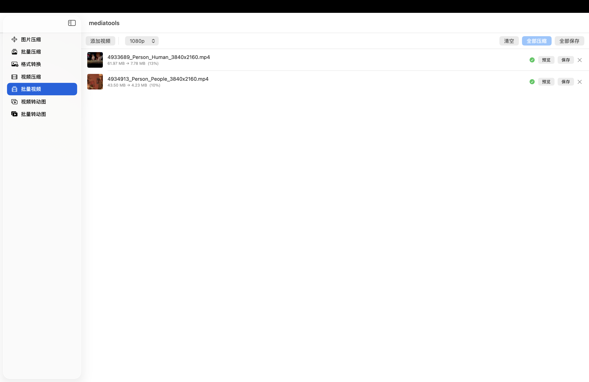
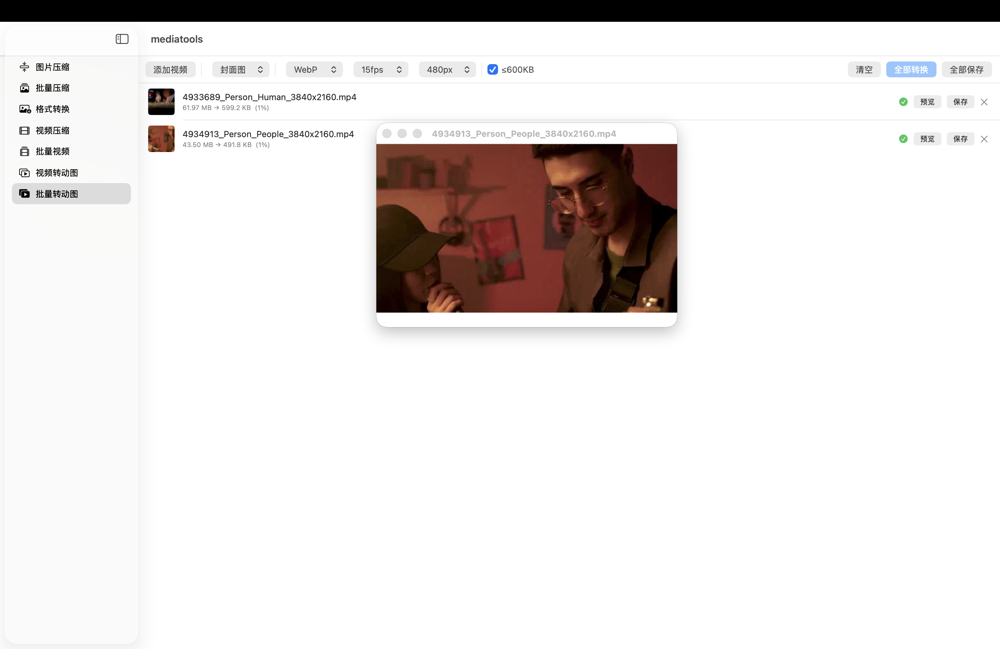
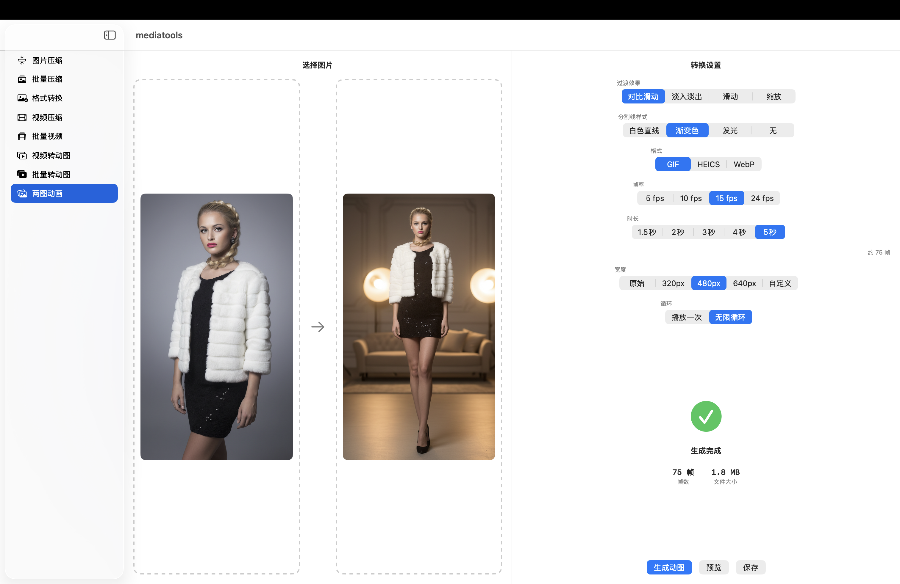

# mediatools

一款原生 macOS 媒体工具套件，使用 SwiftUI 构建。

## 截图

| 图片压缩 | 批量压缩 | 格式转换 |
|:---:|:---:|:---:|
|  |  |  |

| 视频压缩 | 批量视频 | 视频转动图 | 批量转动图 |
|:---:|:---:|:---:|:---:|
|  |  |  |  |

| 两图转动画 |
|:---:|
|  |

## 功能

| 功能 | 说明 |
|------|------|
| 图片压缩 | 单张图片压缩，支持质量调节 |
| 批量压缩 | 批量压缩多张图片 |
| 格式转换 | 图片格式互转（JPEG / PNG / WebP / HEIC 等） |
| 视频压缩 | 单个视频压缩，支持分辨率与码率调节 |
| 批量视频 | 批量视频压缩 |
| 视频转动图 | 将视频片段转为 GIF / WebP / APNG |
| 批量转动图 | 批量将视频转为动图 |
| 两图转动画 | 两张图片生成 Before-After 对比动图，支持多种过渡效果和分割线样式 |

## 系统要求

- macOS 26.2+
- Xcode 26.3 / Swift 5.0

## 依赖

- [libwebp-Xcode](https://github.com/SDWebImage/libwebp-Xcode) 1.5.0 — WebP 编码支持（通过 Swift Package Manager 管理）

## 构建

```bash
# 克隆仓库
git clone https://github.com/LUCK-YXH/mediatools.git
cd mediatools

# 下载 ffmpeg 并放入项目目录
# 从 Releases 页面下载：https://github.com/LUCK-YXH/mediatools/releases
# 下载后执行：
chmod +x mediatools/ffmpeg

# 解析 SPM 依赖
xcodebuild -resolvePackageDependencies -project mediatools.xcodeproj

# Debug 构建
xcodebuild -project mediatools.xcodeproj -scheme mediatools -configuration Debug build

# Release 构建
xcodebuild -project mediatools.xcodeproj -scheme mediatools -configuration Release build
```

## 项目结构

```
mediatools/
├── mediatoolsApp.swift          # 入口
├── ContentView.swift            # 导航根视图
├── Core/
│   └── Tool.swift               # 工具枚举
└── Features/
    ├── ImageCompressor/         # 图片压缩
    ├── ImageConverter/          # 格式转换
    ├── VideoCompressor/         # 视频压缩
    ├── VideoToAnimated/         # 视频转动图
    └── TwoImageAnimator/       # 两图转动画
```

## 架构

采用严格 MVVM 分层：

```
View (SwiftUI struct)
  └── ViewModel (@Observable final class)
        └── Model (struct) + Service (final class singleton)
```

## License

MIT
